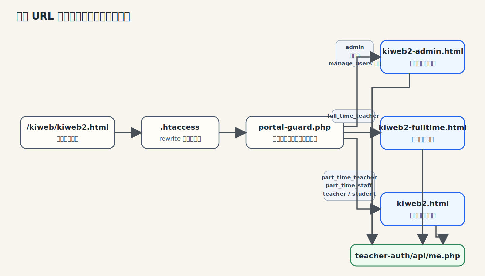
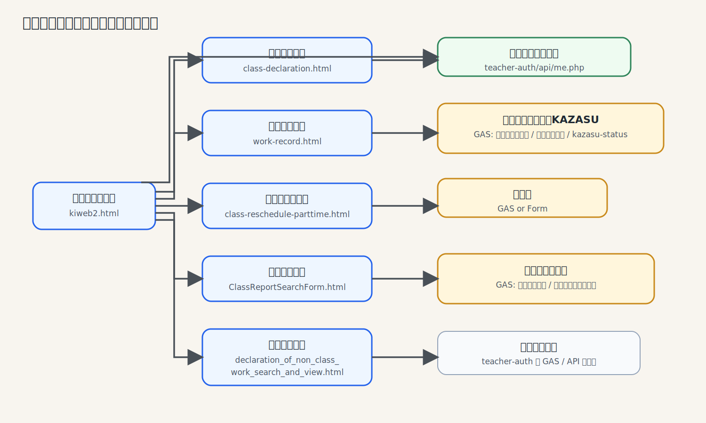

# 講師用ポータルサイト 引継ぎ書

最終更新: 2026-03-30  
対象: `https://system.kyotoijuku.com/kiweb/kiweb2.html`

## この文書について

このポータルは、見た目は単なる HTML 一式ですが、実際には `teacher-auth` の認証、ロール判定、各フォームの GAS 連携まで含めて動いています。  
そのため、どこか 1 か所だけを見ていると全体像を見失いやすいです。

この文書では、まず入口と役割分担を押さえ、そのあとで「どのファイルを触ると何に効くのか」が分かるように整理しています。  
軽い改修や障害対応なら、まずこれを見れば十分です。

## 最初にここだけ押さえる

- `/kiweb/kiweb2.html` が入口ですが、そのまま配信されているわけではありません。ルート `.htaccess` を通って `teacher-auth/public/portal-guard.php` に入ります。
- `portal-guard.php` がログイン状態とロールを見て、`kiweb2.html`、`kiweb2-fulltime.html`、`kiweb2-admin.html` を出し分けます。
- ポータル内の各画面は iframe で開きます。講師名や部署は URL パラメータで引き回しています。
- 画面の出し分けに使う情報は `teacher-auth/api/me.php` から取っています。
- 非常勤向けの現行導線は `kiweb2.html` です。

## 主要 URL

| 用途 | URL | 備考 |
|---|---|---|
| ポータル入口 | `https://system.kyotoijuku.com/kiweb/kiweb2.html` | 実際は `portal-guard.php` 経由 |
| ログイン | `https://system.kyotoijuku.com/kiweb/teacher-auth/public/login.php` | `?name=山田太郎` を付けると登録画面側へ流れる |
| 管理画面 | `https://system.kyotoijuku.com/kiweb/teacher-auth/public/admin.php` | `manage_users` 権限が必要 |
| 授業実施申告 | `class-declaration.html` | 非常勤講師の初期表示 |
| 業務実施申告 | `work-record.html` | 非常勤スタッフの初期表示 |
| 欠勤・振替申請 | `class-reschedule-parttime.html` | 非常勤ポータルで使用 |

## 入口から各画面までの流れ

まずは、入口 URL からどのポータルに振り分けられるかです。

非常勤ポータル `kiweb2.html` から開く主な画面は次の通りです。

## ロールごとの振り分け

振り分けは `teacher-auth/public/portal-guard.php` でやっています。

| ロール/権限 | 表示先 |
|---|---|
| `admin` | `kiweb2-admin.html` |
| `full_time_teacher` | `kiweb2-fulltime.html` |
| `part_time_teacher` | `kiweb2.html` |
| `part_time_staff` | `kiweb2.html` |
| `teacher`, `student` | `kiweb2.html` |
| `manage_users` 権限のみ保有 | `kiweb2-admin.html` |

補足です。

- `part_time_teacher` は `lessons` が初期表示になります。
- `part_time_staff` は `work` が初期表示になります。
- 管理画面リンクの出し分けは、`me.php` の `permissions` に `manage_users` があるかどうかで見ています。

## 主なファイルと役割

| ファイル | 役割 | 触る場面 |
|---|---|---|
| `.htaccess` | 入口 URL の rewrite、公開範囲の制御 | 入口動線や保護ルールを変えるとき |
| `teacher-auth/public/portal-guard.php` | ログイン確認、ロール別振り分け、アクセスログ記録 | 権限制御や入口の挙動を変えるとき |
| `teacher-auth/api/me.php` | ログイン中ユーザーの `roles` `permissions` `scopes` を返す | 画面出し分けや自動入力の元データを変えるとき |
| `kiweb2.html` | 非常勤向けポータル本体 | メニュー、iframe 遷移、パラメータ引き回しの変更 |
| `kiweb2-fulltime.html` | 専任向けポータル | 専任側の導線変更 |
| `kiweb2-admin.html` | 管理者向けポータル | 管理者導線の変更 |
| `class-declaration.html` | 授業予定検索と実施申告 | 授業申告の仕様変更 |
| `work-record.html` | 授業以外の業務実施申告 | 勤務記録の入力項目変更 |
| `class-reschedule-parttime.html` | 非常勤向け欠勤・振替申請 | 欠勤申請フローの変更 |
| `ClassReportSearchForm.html` | 授業申告履歴の検索 | 閲覧系の修正 |
| `declaration_of_non_class_work_search_and_view.html` | 業務申告履歴の検索 | 閲覧系の修正 |
| `teacher-auth/public/admin.php` | 管理画面 | ユーザー管理 UI の修正 |

## 非常勤ポータルの見どころ

### `kiweb2.html`

このファイルが非常勤向けポータルの中心です。  
`PAGES` にメニューと読み込み先を持っていて、`loadPage()` が iframe の URL を組み立てます。

主な読み込み先は次の通りです。

- `lessons`: `class-declaration.html`
- `work`: `work-record.html`
- `absence`: `class-reschedule-parttime.html?v=20260305-no-student-reason&embed=1`
- `check_in_out`: `check_in_out.html`
- `room_allocation`: `room_allocation.html`
- `teacher-no`: `teacher-no-view.html`
- `class-report-search`: `ClassReportSearchForm.html`
- `non-class-work-search`: `declaration_of_non_class_work_search_and_view.html`

起動時は `teacher-auth/api/me.php` を叩いて、氏名、ロール、権限、スコープを取得します。  
その結果でメニュー表示を切り替え、必要なら `department` を業務申告画面へ渡します。

### パラメータの引き回し

iframe に渡している主なパラメータは次の 4 つです。

| パラメータ | 用途 |
|---|---|
| `teacher` | 講師名の自動入力 |
| `department` | 業務実施申告の依頼部署初期値 |
| `theme=parttime` | 非常勤向け配色に切り替える |
| `embed=1` | iframe 埋め込み時の余白調整 |

このあたりは地味ですが、改修時に壊れやすいところです。  
講師名の自動入力が急に効かなくなったときは、まずここを疑ってください。

## 各フォームの役割

### `class-declaration.html`

授業予定を講師名で検索し、当日の実施ステータスを申告する画面です。  
申告済みの確認や、授業申告履歴への導線もここにあります。

依存先:

- `teacher-auth/api/me.php`
- `gas/予定業務データ/Code.gs`
- `gas/実施申告記録/kiweb2用ロジック.gs`
- `gas/kazasu-status/Code.gs`

ポイント:

- `teacher` パラメータがあると講師名を自動入力します。
- 予定業務データは GAS 側で JUST.DB から取得し、`ウェブ用データ` シートと PHP キャッシュを更新しています。
- 申告済み一覧は `gas/実施申告記録/kiweb2用ロジック.gs` 側で管理していて、ScriptCache とシートキャッシュを併用しています。
- KAZASU の最新状態は `gas/kazasu-status/Code.gs` の `doGet` で返しています。

### `work-record.html`

授業以外の業務実施申告です。  
勤務時間、休憩時間、実働時間を画面上で計算します。

依存先:

- `teacher-auth/api/me.php`
- Google Apps Script のフォーム送信先

ポイント:

- `teacher` または `name` で氏名を自動入力します。
- `department` で hidden の部署値を初期化します。
- `allowNameEdit=1` が付いていて、さらに `manage_users` 権限がある場合だけ氏名欄を編集できます。

### `class-reschedule-parttime.html`

非常勤向けの欠勤・振替申請画面です。  
候補データを読み込み、モーダル上で変更内容を編集してから GAS へまとめて送ります。

依存先:

- `teacher-auth/api/absence-schedule.php`
- `gas/欠勤振替申請/main.gs`
- `gas/処理未定の対応状況管理[欠勤振替申請]/kiweb-pending.gs`

ポイント:

- `teacher` または `applicantName` で申請者名と講師名を補完します。
- 学生への連絡状況は hidden 値で持っています。
- 送信は `no-cors` なので、画面上で成功したように見えても GAS 側で失敗していることがあります。
- 欠勤・振替申請の本体は GAS 側でスプレッドシート記録、JUST.DB 登録、Slack DM、チャンネル投稿までまとめて処理しています。
- 処理未定データは別 GAS から PHP 側へ 5 分間隔で同期しています。

### 検索系画面

| ファイル | 依存先 |
|---|---|
| `ClassReportSearchForm.html` | `teacher-auth/api/me.php`, GAS |
| `declaration_of_non_class_work_search_and_view.html` | `teacher-auth/api/work-record-search.php`, `teacher-auth/api/me.php` |
| `check_in_out.html` | `teacher-auth/api/me.php`, GAS |

## 外部依存

このポータルは、ローカルの HTML だけでは完結しません。  
大きく分けると次の 3 つに依存しています。

### 1. `teacher-auth`

ここが落ちると、ログイン、ロール判定、画面出し分けが全部止まります。

- ログイン
- ログアウト
- `me.php`
- 管理画面
- 検索系 API

### 2. Google Apps Script / Google Forms

入力系の画面は、ほぼ何かしらの GAS や Form に依存しています。

- 授業実施申告
- 業務実施申告
- 欠勤・振替申請
- 出退勤
- 履歴検索の一部

GAS 側で列名や受け取りパラメータが変わると、HTML 側もすぐ影響を受けます。

### `gas/` フォルダで見ておくべきもの

`/kiweb/gas` にはいくつか用途の違う Apps Script があります。  
全部を追う必要はありませんが、講師用ポータルの保守で関係が深いものは次の通りです。

| パス | ポータルとの関係 | 役割 | 運用メモ |
|---|---|---|---|
| `gas/予定業務データ/Code.gs` | `class-declaration.html` の予定データ | JUST.DB から予定業務を取得し、`JUSTDBからAPI取得` と `ウェブ用データ` を更新 | `DECLARATION_CACHE_REFRESH_URL` と `DECLARATION_CACHE_REFRESH_TOKEN` の Script Properties が必要 |
| `gas/実施申告記録/kiweb2用ロジック.gs` | `class-declaration.html` の申告済み判定 | `getAllSubmittedTaskNos` / `getSubmittedList` を返し、送信済み状態をキャッシュする | ScriptCache とシート `I/J/K` 列を使う。日次バッチ用のトリガーあり |
| `gas/Code.gs` | 旧系を含む申告記録 API | 実施申告の `doGet` / `doPost` を持つ | 現行では `kiweb2用ロジック.gs` の入口としても使われる |
| `gas/kazasu-status/Code.gs` | `class-declaration.html` の KAZASU 表示 | 生徒ごとの最新打刻状態を JSON で返す | 既定では `Kazasuログシート` を読む |
| `gas/欠勤振替申請/main.gs` | `class-reschedule-parttime.html` の送信先 | スプレッドシート記録、JUST.DB 登録、Slack DM、チャンネル通知 | Slack メンバーID一覧のスプレッドシート参照あり |
| `gas/処理未定の対応状況管理[欠勤振替申請]/kiweb-pending.gs` | 欠勤・振替の補助同期 | 「処理未定」行を抽出して PHP 側へ同期 | `KIWEB_PENDING_SYNC_URL` と `KIWEB_PENDING_SYNC_SECRET` の Script Properties が必要。5 分間隔トリガー前提 |
| `gas/アカウント一覧/アカウント一覧gs` | `teacher-auth` 運用補助 | ユーザー作成 webhook とアカウント一覧同期 | ポータル画面の直接依存ではないが、台帳や運用確認で使う |

この中で、講師ポータルの一次切り分けで特に見るのは次の 4 本です。

- `gas/予定業務データ/Code.gs`
- `gas/実施申告記録/kiweb2用ロジック.gs`
- `gas/kazasu-status/Code.gs`
- `gas/欠勤振替申請/main.gs`

### GAS 側の設定で止まりやすい場所

ポータルの不具合に見えても、実際は GAS 側の設定不足で止まることがあります。  
引継ぎ時点で確認しておいたほうがいいのは次の項目です。

| 対象 | 確認ポイント |
|---|---|
| `gas/予定業務データ/Code.gs` | Script Properties に `DECLARATION_CACHE_REFRESH_URL` と `DECLARATION_CACHE_REFRESH_TOKEN` が入っているか |
| `gas/実施申告記録/kiweb2用ロジック.gs` | 日次バッチトリガーが残っているか、`実施申告records` シートの `I/J/K` キャッシュ列が壊れていないか |
| `gas/kazasu-status/Code.gs` | `Kazasuログシート` に最新ログが入っているか、必要なら `KAZASU_LOG_SPREADSHEET_ID_` の参照先が正しいか |
| `gas/欠勤振替申請/main.gs` | Slack メンバーID一覧スプレッドシートに講師名が存在するか |
| `gas/処理未定の対応状況管理[欠勤振替申請]/kiweb-pending.gs` | Script Properties に `KIWEB_PENDING_SYNC_URL` と `KIWEB_PENDING_SYNC_SECRET` が入っているか、5 分トリガーが生きているか |
| `gas/アカウント一覧/アカウント一覧gs` | `backfill-users-to-sheet.php` との同期が必要なときに `manualBackfillUsers()` / `resetAndBackfillUsers()` を使える状態か |

### 3. `teacher-sync`

ポータルの直接依存ではありませんが、`teacher-auth` のユーザー情報をスプレッドシートに同期する補助 API です。  
講師一覧の外部共有や台帳連携で使うことがあります。

## 保守でハマりやすい点

### 入口 URL を静的 HTML だと思わない

`/kiweb/kiweb2.html` は、見た目はただの HTML です。  
でも実際は `.htaccess` と `portal-guard.php` を通るので、入口まわりの不具合はそこまで含めて見る必要があります。

確認順は次の通りです。

1. `.htaccess`
2. `teacher-auth/public/portal-guard.php`
3. `teacher-auth/api/me.php`
4. 実際に配信される `kiweb2*.html`

### ロールによって見え方がかなり変わる

画面不具合の切り分けでは、どのアカウントで再現しているかが重要です。  
特に差が出るのはこのあたりです。

- `part_time_teacher`
- `part_time_staff`
- `full_time_teacher`
- `admin`
- `manage_users` 権限の有無

### 自動入力は URL パラメータ頼み

講師名や部署の自動入力は、ポータル側で URL に `teacher` や `department` を付けているから動いています。  
フォーム側だけ見ていると原因を見落としやすいです。

### `class-reschedule2.html` は現行導線に入っていない

このファイルはリポジトリにありますが、今の非常勤ポータルからは開かれていません。  
現行導線は次の通りです。

- 非常勤: `class-reschedule-parttime.html`
- 専任/管理者: `class-reschedule.html`

ここを勘違いして `class-reschedule2.html` を直しても、運用には反映されません。

## よくある改修

### メニューを増やす

1. `kiweb2.html` の `PAGES` に追加
2. サイドバーとモバイルメニューにも追加
3. 必要なら `teacher` や `department` を渡す
4. iframe 埋め込み時の見え方を確認

### ロールごとの表示先を変える

1. `teacher-auth/public/portal-guard.php` を修正
2. `kiweb2*.html` 側の既定タブも合わせて確認
3. 管理画面リンクの表示条件も確認

### 氏名や部署の初期値を変える

1. `teacher-auth/api/me.php` の返却値を確認
2. `kiweb2.html` の `refreshUserName()` と `loadPage()` を確認
3. 各フォーム側の URL パラメータ読込を確認

### 管理画面でできることを増やす

1. `permissions` を追加
2. `admin.php` と `admin.js` を更新
3. 必要なら `api/admin/*` も追加
4. ポータル側の表示制御で使うなら `me.php` も確認

## 障害時の見方

### ポータルに入れない

1. `/kiweb/teacher-auth/public/login.php` が開くか
2. ログイン後に `/kiweb/kiweb2.html` が開くか
3. rewrite が効いているか
4. `teacher-auth/api/me.php` が 200 を返すか

### 名前が自動入力されない

1. `me.php` の `user.name`
2. `kiweb2.html` のヘッダー表示名
3. iframe URL に `teacher=` が付いているか
4. フォーム側で `teacher` や `name` を読んでいるか

### 業務実施申告で部署が入らない

1. `me.php` の `scopes.department`
2. `kiweb2.html` の `loadPage()` で `department` を付けているか
3. `work-record.html` の hidden `department` に値が入っているか

### 申告が送れない

1. 画面側の JS エラー
2. 送信先の GAS / Form URL
3. パラメータ名の変更
4. GAS 側ログ

### 授業申告の予定が出ない、申告済み表示がおかしい

1. `gas/予定業務データ/Code.gs` の更新が止まっていないか
2. `ウェブ用データ` シートが更新されているか
3. PHP キャッシュ更新 API が失敗していないか
4. `gas/実施申告記録/kiweb2用ロジック.gs` のキャッシュ列 `I/J/K` が壊れていないか
5. `gas/kazasu-status/Code.gs` の元シートに当日ログがあるか

### 欠勤・振替申請は送れたように見えるのに反映されない

1. `class-reschedule-parttime.html` が見ている送信先 URL を確認
2. `gas/欠勤振替申請/main.gs` の実行ログを確認
3. Slack メンバーID一覧に氏名があるか確認
4. JUST.DB への書き込みに失敗していないか確認
5. 「処理未定」連携が絡む場合は `gas/処理未定の対応状況管理[欠勤振替申請]/kiweb-pending.gs` のトリガーと Script Properties を確認

## 初回確認チェックリスト

- ログインできる
- ログイン後に `/kiweb/kiweb2.html` が開く
- 非常勤講師で授業申告が初期表示される
- 非常勤スタッフで業務実施申告が初期表示される
- 管理者で管理画面リンクが出る
- `class-declaration.html` に講師名が引き継がれる
- `work-record.html` に講師名と部署が引き継がれる
- `class-reschedule-parttime.html` に申請者名と講師名が引き継がれる
- 授業履歴検索と業務履歴検索が動く

## 超入門の説明

このシステムをひとことで言うと、講師が仕事をするときに使う社内ポータルです。  
ここから授業の実施報告、授業以外の業務報告、欠勤や振替の申請などを行います。

見た目は Web ページの集まりですが、実際は次の 4 つがつながって動いています。

1. 入口
   講師が最初に開く場所です。`/kiweb/kiweb2.html` がここに当たります。
2. 振り分け
   ログインしているか、管理者か、専任か、非常勤かを見て、どの画面を出すか決めます。
3. 入力画面
   講師が実際に使う画面です。授業申告、業務申告、欠勤申請などがあります。
4. 裏側の処理
   入力された内容を保存したり、別の仕組みに送ったりする部分です。ここで `teacher-auth`、Google Apps Script、スプレッドシート、JUST.DB、Slack が動いています。

たとえると、次のように考えると分かりやすいです。

- `kiweb2.html` は建物の入口です。
- `portal-guard.php` は受付です。
- `teacher-auth/api/me.php` は「この人は誰で、何をしてよいか」を確認する名簿です。
- `class-declaration.html` や `work-record.html` は窓口です。
- `gas` フォルダの中身は、受付の裏で記録や連絡をしている事務作業です。

つまり、このシステムは「HTML だけでできたサイト」ではありません。  
画面の後ろで、認証、権限判定、スプレッドシート更新、通知送信がつながっている運用システムです。

## 初心者がつまずきやすい点

このシステムを初めて見る人が、特につまずきやすいのは次の点です。

### 1. 画面に見えているものだけが本体ではない

`kiweb2.html` や `class-declaration.html` を見ると、これがシステム本体に見えます。  
でも実際には、入口の振り分けは `portal-guard.php`、ユーザー情報の取得は `me.php`、保存や通知は GAS が担当しています。

### 2. 同じ URL でも人によって見える画面が違う

同じ `/kiweb/kiweb2.html` を開いても、管理者、専任、非常勤で表示先が変わります。  
そのため、「自分には見えるのに相手には見えない」ということが普通に起こります。

### 3. 氏名や部署が自動で入る理由が見えにくい

これは魔法ではなく、ポータル側が URL に `teacher` や `department` を付けて次の画面へ渡しているからです。  
ここが切れると、自動入力が急に効かなくなります。

### 4. GAS が実質的な裏側のシステムになっている

このシステムでは、普通の Web システムならサーバー側でやるような処理を、Google Apps Script がかなり受け持っています。  
そのため、画面の不具合に見えても、原因は `gas` 側にあることが少なくありません。

### 5. 外部依存が多い

このシステムは単体では完結していません。  
`teacher-auth`、Google Apps Script、スプレッドシート、JUST.DB、Slack のどこかが止まると、画面も影響を受けます。

## 理解を補うために読むとよい資料

まずは、次の順番で読むと全体像をつかみやすいです。

1. この文書
   全体像をつかむための入口です。
2. `teacher-auth/public/portal-guard.php`
   誰にどの画面を見せるかを決めています。
3. `teacher-auth/api/me.php`
   ログイン中のユーザー情報を返しています。
4. `kiweb2.html`
   非常勤ポータルの中心です。
5. `gas/予定業務データ/Code.gs`
   授業予定データがどこから来るかが分かります。
6. `gas/実施申告記録/kiweb2用ロジック.gs`
   授業申告の保存や申告済み判定の流れが分かります。
7. `gas/欠勤振替申請/main.gs`
   欠勤・振替申請の裏側が分かります。

## 先に知っておくと楽になる基礎用語

次の言葉があいまいだと、このシステムは少し分かりにくくなります。  
もし不安があれば、この順に軽く調べるのがおすすめです。

- ログイン
- 権限
- ロール
- API
- URL パラメータ
- iframe
- Google Apps Script
- スプレッドシートをデータ置き場として使う考え方

## まずはここまで分かれば十分

最初の段階では、次の理解ができていれば十分です。

- 入口は `/kiweb/kiweb2.html`
- 途中で `portal-guard.php` が画面を振り分ける
- `me.php` がユーザー情報を返す
- 実際の入力画面は複数ある
- 保存や通知は `gas` が担当している

ここまで分かれば、あとは「どの画面で困っているか」と「その画面の裏でどの GAS が動いているか」を追うだけで、かなり切り分けできるようになります。

## 関連資料

細かい背景や過去の経緯は、次の資料を見ると追えます。

- `HANDOVER.md`
- `teacher-auth/HANDOFF.md`
- `teacher-auth/USAGE.md`
- `teacher-auth/SETUP.md`
- `teacher-auth/CHECKLIST.md`
- `login/API_SPEC.md`
- `teacher-sync/README.md`
- `gas/予定業務データ/Code.gs`
- `gas/実施申告記録/kiweb2用ロジック.gs`
- `gas/kazasu-status/Code.gs`
- `gas/欠勤振替申請/main.gs`
- `gas/処理未定の対応状況管理[欠勤振替申請]/kiweb-pending.gs`
- `gas/アカウント一覧/アカウント一覧gs`

## 最後に

このポータルは、静的 HTML の寄せ集めというより、`teacher-auth` と GAS の上に載った運用システムだと思って見たほうが実態に近いです。  
入口、認証、URL パラメータ、外部送信先。この 4 つを押さえておけば、大きく外すことはありません。
