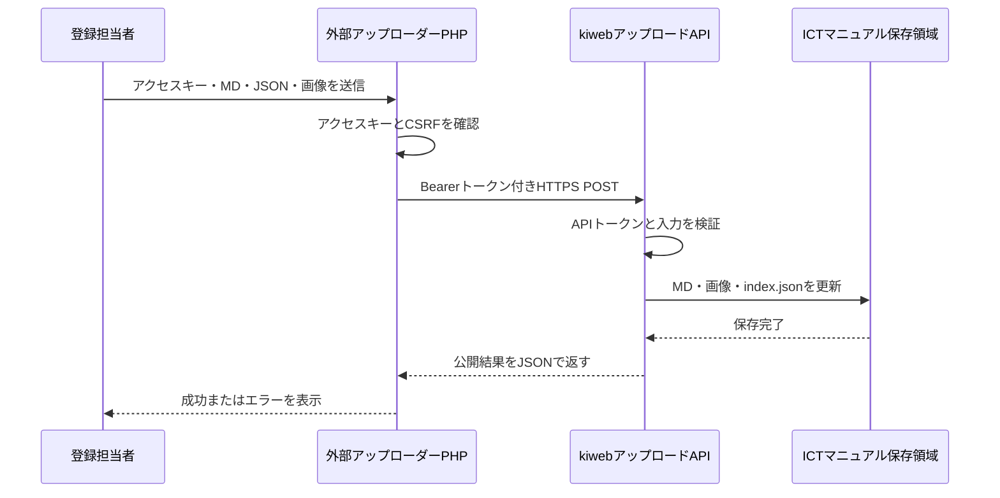
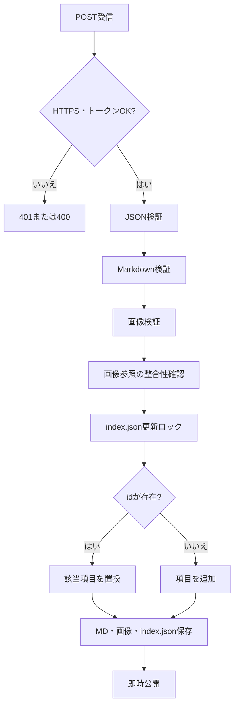

# ICTマニュアル 外部アップロード仕様

## 1. 目的

kiwebのログインとは独立した外部PHPサイトから、Markdown、メタ情報JSON、画像を送信し、ICTマニュアルへ即時反映する。

外部サイトのブラウザへkiweb API用トークンを渡さず、外部サイトのPHPからkiweb APIへサーバー間通信を行う。

## 2. 構成



## 3. 認証

### 3.1 APIトークン

外部アップローダーのPHPサーバーをkiweb側が認証する共有秘密情報。

- 32文字以上とする。
- 推奨値は `openssl rand -hex 32` で生成する。
- kiwebと外部サーバーの環境変数に同じ値を設定する。
- HTML、JavaScript、Git、ログには出力しない。
- `Authorization: Bearer ...` と `X-ICT-Manual-Token` のどちらでもAPIが受け付ける。

kiweb側:

```text
ICT_MANUAL_UPLOAD_TOKEN=64文字以上のランダム値
ICT_MANUAL_UPLOAD_REQUIRE_HTTPS=true
```

### 3.2 外部サイトのアクセスキー

外部アップローダー画面を発見した第三者が利用できないようにする別のキー。

```text
ICT_MANUAL_UPLOADER_ACCESS_KEY=登録担当者へ伝える12文字以上の値
```

これはkiweb APIトークンとは別の値にする。ログインセッションは作らず、登録時に毎回入力する。

## 4. API

```text
POST /kiweb/teacher-auth/public/ict-manual-upload-api.php
Content-Type: multipart/form-data
Authorization: Bearer {ICT_MANUAL_UPLOAD_TOKEN}
```

送信項目:

| 項目 | 必須 | 内容 |
|---|---:|---|
| `metadata` | 必須 | 1件分のJSONファイル |
| `markdown` | 必須 | Markdownファイル |
| `images[]` | 任意 | PNG、JPEG、GIF、WebP。最大20枚 |

成功時:

```json
{
  "success": true,
  "manual": {
    "id": "room-booking",
    "file": "room-booking.md",
    "image_count": 2,
    "updated": "2026-06-20"
  },
  "view_url": "/kiweb/teacher-auth/public/ict-manual.php#manual-room-booking",
  "request_id": "..."
}
```

## 5. JSON仕様

```json
{
  "id": "room-booking",
  "title": "会議室予約の使い方",
  "category": "会議室予約",
  "description": "会議室予約システムの基本操作を説明します。",
  "updated": "2026-06-20",
  "target": ["fulltime", "admin"],
  "tags": ["会議室", "予約", "専任"],
  "priority": "medium",
  "order": 80,
  "visible": true
}
```

検証規則:

| 項目 | 規則 |
|---|---|
| `id` | 必須。英数字、ハイフン、アンダースコア。80文字以下 |
| `title` | 必須。120文字以下 |
| `category` | 必須。80文字以下 |
| `file` | 省略推奨。指定時は `{id}.md` と完全一致 |
| `description` | 必須。300文字以下 |
| `updated` | 必須。実在する日付を `YYYY-MM-DD` で指定 |
| `target` | 必須。`all`、`parttime`、`fulltime`、`admin` |
| `tags` | 任意。最大20件、各40文字以下 |
| `priority` | 任意。`high`、`medium`、`low`。省略時 `medium` |
| `order` | 任意。0から9999の整数。省略時999 |
| `visible` | 任意。真偽値。省略時 `true` |

`target` に `all` を指定する場合、他の値は同時指定できない。未対応のJSON項目は入力ミスとして拒否する。

## 6. Markdownと画像

Markdownの保存名はAPIが `{id}.md` に決定する。

画像は次のパスへ保存する。

```text
teacher-auth/ict-manual/assets/images/{id}/{画像ファイル名}
```

Markdown内の記述:

```markdown

```

画像規則:

- PNG、JPEG、GIF、WebPのみ。SVGは受け付けない。
- 画像ファイル名は英数字、ハイフン、アンダースコアのみ。
- 1枚5MB以下、合計30MB以下、1回20枚以下。
- 縦横12000px以下。
- 拡張子だけでなく、MIMEタイプと実画像データを確認する。
- 同一ID・同一ファイル名は上書きする。
- Markdownから参照する画像は、同時アップロードするか既存ファイルとして存在する必要がある。

## 7. 反映処理



同じ `id` は上書きし、新しい `id` は `index.json` に追加する。`index.json` は同時更新による消失を防ぐため、更新中に排他ロックする。

初期実装では履歴管理、承認、ロールバック、古い未使用画像の自動削除は行わない。

## 8. 外部サイト配置

`tools/ict-manual-uploader/` を外部PHPサーバーへ配置する。

必要な環境変数:

```text
ICT_MANUAL_API_URL=https://system.example.com/kiweb/teacher-auth/public/ict-manual-upload-api.php
ICT_MANUAL_UPLOAD_TOKEN=kiweb側と同じAPIトークン
ICT_MANUAL_UPLOADER_ACCESS_KEY=登録担当者用の別キー
```

必要環境:

- PHP 7.4以上
- PHP cURL拡張
- HTTPS
- `upload_max_filesize` 5MB以上
- `post_max_size` 35MB以上

kiweb側も同様に `upload_max_filesize` と `post_max_size` を設定する。PHP設定の上限を超えると、APIの入力検証より前にPHPがリクエストを破棄する。

## 9. 本番反映前確認

- kiweb側と外部側に同じAPIトークンを設定する。
- 外部側のアクセスキーはAPIトークンとは別にする。
- `teacher-auth/ict-manual/manuals/` と `assets/images/` をWebサーバーから書き込み可能にする。
- `teacher-auth/ict-manual/` が外部から直接閲覧できないことを確認する。
- HTTPS以外のAPIリクエストが拒否されることを確認する。
- 新規IDと既存ID上書きの両方をテストする。
